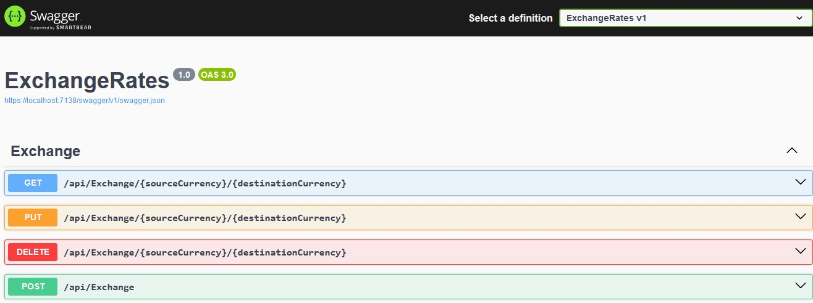

# VFX Task

### Setup
1. First create a database in your development server and open a window to run some scripts
1. Open the project solution «VFX-Task.sln» and go to ExchangeDB project
1. Run the script in tables folder
1. Run the scripts in procedures folder
1. Go to ExchangeRates project and make th necessary ajustements to the settings file «appsettings.json»

Now you're ready to try out the service!

## Debug
Build and run the ExchangeRates project and Swagger page should apper to you:

## Examples requests
To help on how to make calls to these endpoints here are some CURLs

#### Read
curl --location 'https://localhost:7138/api/Exchange/eur/xof' \
--header 'accept: text/plain'

#### Update
curl --location --request PUT 'https://localhost:7138/api/Exchange/eur/xof' \
--header 'accept: text/plain' \
--header 'Content-Type: application/json' \
--data '{
  "sourceCurrency": "string",
  "destinationCurrency": "string",
  "bidValue": 0.2344,
  "askValue": 1.9040
}'

#### Delete
curl --location --request DELETE 'https://localhost:7138/api/Exchange/eur/huf' \
--header 'accept: text/plain'

#### Insert
curl --location 'https://localhost:7138/api/Exchange' \
--header 'accept: text/plain' \
--header 'Content-Type: application/json' \
--data '{
  "sourceCurrency": "USD",
  "destinationCurrency": "JPY",
  "bidValue": 0.2344,
  "askValue": 1.9040
}'

### Points to improve:
1. Configure logging for proper folder/database
1. Add further unit test to repositories (this will nedd some code refactoring)
